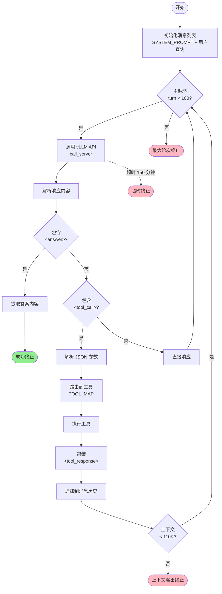

# DeepResearch 架构分析文档

## 目录
- [1. 系统架构可视化](#1-系统架构可视化)
- [2. 核心模块功能说明](#2-核心模块功能说明)
- [3. 关键代码路径标注](#3-关键代码路径标注)
- [4. 扩展点识别](#4-扩展点识别)

---

## 1. 系统架构可视化

### 1.1 整体系统架构

```
┌─────────────────────────────────────────────────────────────────────┐
│                        DeepResearch 系统架构                          │
└─────────────────────────────────────────────────────────────────────┘

┌─────────────────────────────────────────────────────────────────────┐
│                          输入层 (Input Layer)                        │
├─────────────────────────────────────────────────────────────────────┤
│  • JSONL/JSON 数据集                                                 │
│  • 用户查询 (Question)                                                │
│  • 参考文件 (eval_data/file_corpus/)                                 │
└────────────────────────────┬────────────────────────────────────────┘
                             │
                             ▼
┌─────────────────────────────────────────────────────────────────────┐
│                    推理协调层 (Orchestration Layer)                   │
├─────────────────────────────────────────────────────────────────────┤
│                                                                       │
│  ┌──────────────────────────────────────────────────────────┐      │
│  │         run_multi_react.py (多线程调度器)                  │      │
│  │  • ThreadPoolExecutor (max_workers=20)                    │      │
│  │  • 端口轮询分配 (6001-6008)                                │      │
│  │  • Rollout 管理 (默认 3 次)                                │      │
│  │  • 检查点恢复 (Checkpoint)                                 │      │
│  └────────────────┬─────────────────────────────────────────┘      │
│                   │                                                  │
└───────────────────┼──────────────────────────────────────────────────┘
                    │
                    ▼
┌─────────────────────────────────────────────────────────────────────┐
│                      代理核心层 (Agent Core Layer)                    │
├─────────────────────────────────────────────────────────────────────┤
│                                                                       │
│  ┌──────────────────────────────────────────────────────────┐      │
│  │    MultiTurnReactAgent (ReAct 主循环)                     │      │
│  │                                                            │      │
│  │  1. 初始化消息历史                                          │      │
│  │     ├─ SYSTEM_PROMPT (工具定义 + 指令)                     │      │
│  │     └─ 用户查询                                            │      │
│  │                                                            │      │
│  │  2. 主循环 (最多 100 轮, 150 分钟超时)                      │      │
│  │     ├─ call_server() → vLLM/OpenRouter                    │      │
│  │     ├─ 解析 <tool_call> XML 标签                           │      │
│  │     ├─ 提取 JSON 参数                                       │      │
│  │     ├─ custom_call_tool() → 工具分发                       │      │
│  │     └─ 包装 <tool_response> 返回                           │      │
│  │                                                            │      │
│  │  3. 终止条件                                               │      │
│  │     ├─ 发现 <answer> 标签 ✓                                │      │
│  │     ├─ 超时 (9000 秒)                                      │      │
│  │     ├─ 上下文溢出 (110K tokens)                             │      │
│  │     └─ 达到最大调用次数                                     │      │
│  └────────────────┬─────────────────────────────────────────┘      │
│                   │                                                  │
└───────────────────┼──────────────────────────────────────────────────┘
                    │
                    ▼
┌─────────────────────────────────────────────────────────────────────┐
│                      工具执行层 (Tool Execution Layer)                │
├─────────────────────────────────────────────────────────────────────┤
│                                                                       │
│  ┌──────────────┐  ┌──────────────┐  ┌──────────────┐              │
│  │   Search     │  │    Visit     │  │  FileParser  │              │
│  │              │  │              │  │              │              │
│  │ Serper API   │  │ Jina AI +    │  │ Dashscope    │              │
│  │ • 批量查询   │  │ LLM 摘要     │  │ IDP Service  │              │
│  │ • 中英文检测 │  │ • 3 阶段处理 │  │ • 15+ 格式   │              │
│  │ • 重试机制   │  │ • 95K 截断   │  │ • 异步解析   │              │
│  └──────────────┘  └──────────────┘  └──────────────┘              │
│                                                                       │
│  ┌──────────────┐  ┌──────────────────────────────────────┐        │
│  │   Scholar    │  │      PythonInterpreter               │        │
│  │              │  │                                      │        │
│  │ Google       │  │ SandboxFusion (字节跳动)              │        │
│  │ Scholar API  │  │ • 8 次重试                            │        │
│  │ • 引用计数   │  │ • 多端点负载均衡                      │        │
│  │ • PDF 链接   │  │ • 50 秒超时                           │        │
│  └──────────────┘  └──────────────────────────────────────┘        │
│                                                                       │
└────────────────────────────┬────────────────────────────────────────┘
                             │
                             ▼
┌─────────────────────────────────────────────────────────────────────┐
│                      模型推理层 (LLM Inference Layer)                 │
├─────────────────────────────────────────────────────────────────────┤
│                                                                       │
│  ┌────────────────────────────────────────────────────────┐         │
│  │         vLLM 服务器集群 (8 个实例)                       │         │
│  │                                                          │         │
│  │  GPU 0: Port 6001    GPU 4: Port 6005                   │         │
│  │  GPU 1: Port 6002    GPU 5: Port 6006                   │         │
│  │  GPU 2: Port 6003    GPU 6: Port 6007                   │         │
│  │  GPU 3: Port 6004    GPU 7: Port 6008                   │         │
│  │                                                          │         │
│  │  模型: Tongyi-DeepResearch-30B-A3B                       │         │
│  │  参数: temperature=0.85, presence_penalty=1.1            │         │
│  │  停止标记: ["\n<tool_response>", "<tool_response>"]      │         │
│  └──────────────────────────────────────────────────────────┘        │
│                                                                       │
└────────────────────────────┬────────────────────────────────────────┘
                             │
                             ▼
┌─────────────────────────────────────────────────────────────────────┐
│                         输出层 (Output Layer)                        │
├─────────────────────────────────────────────────────────────────────┤
│  • JSONL 输出文件                                                     │
│  • 字段: question, answer, prediction, termination, messages         │
│  • 评估指标: accuracy, confidence                                    │
└─────────────────────────────────────────────────────────────────────┘
```

### 1.2 ReAct 代理执行流程图



### 1.3 工具系统架构图

```
┌───────────────────────────────────────────────────────────────────┐
│                          TOOL_MAP 注册表                           │
│  {"search": Search(), "visit": Visit(), ...}                      │
└───────────────┬───────────────────────────────────────────────────┘
                │
                ▼
        custom_call_tool()
                │
    ┌───────────┴───────────┐
    │   解析 tool_name       │
    │   解析 arguments       │
    └───────────┬───────────┘
                │
    ┌───────────┴────────────────────────────────────────┐
    │                                                     │
    ▼                                                     ▼
┌─────────────────┐                            ┌──────────────────┐
│  同步工具        │                            │  异步工具         │
│  • Search       │                            │  • FileParser    │
│  • Visit        │                            │    (async parse) │
│  • Scholar      │                            └──────────────────┘
│  • Python       │
└─────────────────┘

每个工具的执行流程：
┌──────────────────────────────────────────────────────────────────┐
│                      工具执行生命周期                              │
├──────────────────────────────────────────────────────────────────┤
│  1. 参数解析     tool.call(params_json, **kwargs)                │
│  2. 参数验证     检查必需参数                                      │
│  3. 外部 API 调用  HTTP 请求 + 重试机制                            │
│  4. 结果处理     格式化、截断、错误处理                             │
│  5. 返回字符串   Markdown 格式                                    │
└──────────────────────────────────────────────────────────────────┘
```

### 1.4 WebAgent 家族架构图

```
┌─────────────────────────────────────────────────────────────────┐
│                      WebAgent/ 目录结构                          │
└─────────────────────────────────────────────────────────────────┘

├─ NestBrowse/          浏览器代理 + MCP 协议
│  ├─ infer_async_nestbrowse.py  (异步主循环)
│  ├─ toolkit/
│  │  ├─ browser.py     (Visit, Click, Fill 工具)
│  │  ├─ mcp_client.py  (Model Context Protocol 客户端)
│  │  └─ tool_search.py (搜索工具)
│  └─ prompts.py        (系统提示词)
│
├─ ParallelMuse/        并行轨迹聚合
│  ├─ compressed_reasoning_aggregation.py
│  │  • 多轨迹并行执行
│  │  • 每个轨迹 → 结构化报告 (REPORT_PROMPT)
│  │  • 聚合报告 → 最终答案 (INTEGRATE_PROMPT)
│  └─ 使用 asyncio + 信号量限流
│
├─ WebDancer/           原生代理搜索模型 (NeurIPS 2025)
│  ├─ 4 阶段训练: 数据构建 → 轨迹采样 → SFT → RL
│  ├─ scripts/
│  │  ├─ deploy_model.sh  (sglang 部署)
│  │  └─ run_demo.sh      (Gradio 演示)
│  └─ ReAct 框架 + Web 工具
│
├─ WebSailor/           超人推理 Web 代理
│  ├─ SailorFog-QA 基准数据集
│  ├─ DUPO (Duplicating Sampling Policy Optimization) RL 算法
│  └─ 2 阶段训练: RFT 冷启动 → DUPO 强化学习
│
├─ WebWatcher/          视觉语言深度研究代理
│  ├─ 多模态工具: ImageSearch + CodeInterpreter
│  └─ 视觉推理能力
│
├─ WebShaper/           基于形式化的数据合成
│  ├─ 代理扩展器 (Agentic Expander)
│  └─ 任务形式化驱动的数据生成
│
├─ WebWeaver/           动态大纲结构化证据
│  └─ 开放式深度研究
│
├─ WebResearcher/       长视野无界推理
│  └─ 上下文摘要策略
│
├─ WebResummer/         上下文摘要解锁长视野搜索
│  └─ ReSum 算法
│
└─ WebLeaper/           高效信息密集型搜索
   └─ 信息跳跃策略

共享基础设施:
• inference/tool_*.py (工具实现)
• 相似的 ReAct 循环模式
• 独立的评估脚本
```

---

## 2. 核心模块功能说明

### 2.1 推理协调模块 (inference/run_multi_react.py)

**职责**: 多线程推理任务调度与管理

**核心功能**:
```python
主函数: main()
├─ 加载数据集 (load_jsonl_or_json)
│  • 支持 JSONL 和 JSON 两种格式
│  • 解析 question 和 answer 字段
│
├─ 初始化线程池 (ThreadPoolExecutor)
│  • max_workers: 可配置并发数
│  • 端口轮询策略: ports[idx % len(ports)]
│
├─ 提交任务 (futures)
│  • 每个问题 × roll_out_count 次 rollout
│  • 检查点机制: 跳过已完成的任务
│
├─ 收集结果
│  • as_completed() 异步收集
│  • 实时写入 JSONL 输出
│
└─ 错误处理
   • 捕获工具异常
   • 记录失败任务
```

**关键参数**:
- `--max_workers`: 并发线程数 (默认 20)
- `--roll_out_count`: 每个问题的 rollout 次数 (默认 3)
- `--total_splits` / `--worker_split`: 分布式推理的分片参数

**输出格式**:
```json
{
  "question": "用户查询",
  "answer": "参考答案",
  "prediction": "模型预测",
  "termination": "answer|timeout|max_turn_exceeded|context_length_exceeded",
  "messages": [{"role": "system|user|assistant", "content": "..."}],
  "summary_record": "简化的交互记录"
}
```

### 2.2 ReAct 代理核心 (inference/react_agent.py)

**职责**: 实现 Reasoning + Acting 循环

**核心类**: `MultiTurnReactAgent`

```python
关键方法:

1. __init__(function_list, llm)
   • 初始化 LLM 配置
   • 设置生成参数 (temperature, top_p, presence_penalty)

2. _run(data, model, planning_port)
   • 主执行循环
   • 返回: messages, prediction, termination

3. call_server(msgs, planning_port, max_tries=10)
   • 调用 vLLM/OpenRouter API
   • 重试机制: 指数退避
   • 停止标记: ["\n<tool_response>", "<tool_response>"]
   • 返回: LLM 生成的文本

4. custom_call_tool(tool_name, tool_args)
   • 工具分发逻辑
   • 异步工具处理 (FileParser)
   • 错误包装
```

**执行流程详解**:
```python
# inference/react_agent.py 第 126-226 行

messages = [system_msg, user_msg]
for turn in range(MAX_LLM_CALL_PER_RUN):
    # 1. 调用 LLM
    response = self.call_server(messages, planning_port)
    messages.append({"role": "assistant", "content": response})

    # 2. 检查答案
    if "<answer>" in response and "</answer>" in response:
        prediction = extract_between_tags(response, "answer")
        termination = "answer"
        break

    # 3. 解析工具调用
    if "<tool_call>" in response:
        tool_calls = extract_tool_calls(response)
        for tool_call in tool_calls:
            # 3.1 解析 JSON
            func_name = tool_call["name"]
            func_args = tool_call["arguments"]

            # 3.2 执行工具
            tool_result = self.custom_call_tool(func_name, func_args)

            # 3.3 包装响应
            obs = f"<tool_response>\n{tool_result}\n</tool_response>"
            messages.append({"role": "user", "content": obs})

    # 4. 检查上下文长度
    if get_token_count(messages) > 110000:
        termination = "context_length_exceeded"
        break

    # 5. 检查超时
    if time.time() - start_time > 9000:  # 150 分钟
        termination = "timeout"
        break
```

**重试策略**:
```python
# call_server 中的重试逻辑
base_sleep_time = 1
for attempt in range(max_tries):
    try:
        response = client.chat.completions.create(...)
        if response.content.strip():
            return response.content.strip()
    except (APIError, APIConnectionError, APITimeoutError) as e:
        sleep_time = base_sleep_time * (2 ** attempt)  # 指数退避
        time.sleep(sleep_time)
```

### 2.3 工具系统模块

#### 2.3.1 Search 工具 (inference/tool_search.py)

**API**: Serper API (google.serper.dev)

```python
核心方法: google_search_with_serp(query_list, api_key)

处理流程:
1. 批量查询处理
   for query in query_list:
       # 检测语言
       location = detect_language(query)  # "China" 或 "United States"

       # API 请求
       payload = {
           "q": query,
           "num": 10,
           "location": location
       }
       response = requests.post(url, json=payload, headers=headers)

2. 结果格式化
   for result in organic_results:
       output += f"## {title}\n"
       output += f"URL: {link}\n"
       output += f"{snippet}\n"
       output += f"Date: {date}\n\n"

3. 重试机制
   max_retries = 5
   for i in range(max_retries):
       try:
           return perform_search()
       except Exception:
           if i == max_retries - 1:
               return "搜索失败，请重试"
```

**输出格式**:
```
# 搜索查询: "深度学习"

## 深度学习 - 维基百科
URL: https://zh.wikipedia.org/wiki/深度学习
深度学习是机器学习的分支，使用多层神经网络...
Date: 2024-01-15
Source: Wikipedia

## ...
```

#### 2.3.2 Visit 工具 (inference/tool_visit.py)

**三阶段处理管道**:

```python
阶段 1: 页面抓取 (readpage_jina)
├─ API: r.jina.ai/{url}
├─ 认证: Bearer token (JINA_API_KEYS)
├─ 重试: 3 次
├─ 超时: VISIT_SERVER_TIMEOUT (200 秒)
└─ 输出: 原始 HTML/Markdown 文本

阶段 2: Token 截断
├─ 最大长度: WEBCONTENT_MAXLENGTH (95,000 tokens)
├─ 编码器: Qwen tokenizer
└─ 策略: 截断超长内容

阶段 3: LLM 摘要 (extract_relevant_info)
├─ 提示词: EXTRACTOR_PROMPT
├─ 输入:
│  • webpage_content: 网页内容
│  • goal: 用户目标
├─ 输出 JSON:
│  {
│    "rational": "定位相关部分的理由",
│    "evidence": "提取的原始上下文（完整）",
│    "summary": "简洁的段落总结"
│  }
└─ 重试: 3 次 API 调用
```

**工具调用示例**:
```xml
<tool_call>
{"name": "visit", "arguments": {
  "url": ["https://example.com/article"],
  "goal": "找到文章中关于量子计算的最新进展"
}}
</tool_call>
```

**输出示例**:
```markdown
# URL: https://example.com/article

**理由 (Rationale):**
该网页包含 2024 年量子计算的最新研究进展部分...

**证据 (Evidence):**
研究人员在 2024 年 3 月宣布，他们成功实现了...
[完整的原始段落内容]

**总结 (Summary):**
量子计算在 2024 年取得三大突破：纠错码改进、
量子比特数量增加到 1000 个、首次实用化应用...
```

#### 2.3.3 FileParser 工具 (inference/tool_file.py)

**支持的文件类型**:
```python
SUPPORTED_FORMATS = [
    # 文档类
    'pdf', 'docx', 'pptx', 'txt', 'html',
    'doc', 'csv', 'tsv', 'xlsx', 'xls',

    # 压缩包
    'zip',

    # 音视频
    'mp4', 'mp3', 'wav', 'aac', 'ogg',
    'flac', 'mov', 'mkv', 'webm'
]
```

**异步处理架构**:
```python
async def parse_files_async(file_list):
    tasks = []
    for file in file_list:
        if is_audio(file):
            # 音频文件 → video_agent.py
            task = parse_audio(file)
        else:
            # 文档文件 → file_parser.py
            task = SingleFileParser.parse(file)
        tasks.append(task)

    results = await asyncio.gather(*tasks)
    return results
```

**解析流程 (file_tools/file_parser.py)**:
```python
SingleFileParser.parse(file_path):
    1. 类型检测
       ext = get_file_extension(file_path)

    2. 选择解析器
       if USE_IDP:
           # Alibaba IDP 服务
           result = idp_parse(file_path)
       else:
           # 本地解析器
           if ext == 'pdf':
               result = parse_pdf_native(file_path)
           elif ext == 'xlsx':
               result = parse_excel_native(file_path)
           ...

    3. 格式化输出
       pages = []
       for page in result:
           pages.append({
               'page_num': page.num,
               'text': page.text,
               'tables': page.tables,
               'images': page.images
           })

       return format_as_markdown(pages)
```

**IDP 服务集成 (file_tools/idp.py)**:
```python
IDP 调用流程:
1. 提交文件
   POST https://docmind-api.cn-hangzhou.aliyuncs.com/api/v1/alchemy/document/submit
   Body: {
       "FileUrl": "https://...",
       "FileName": "report.pdf"
   }

2. 轮询结果
   GET /api/v1/alchemy/document/query?Id={doc_id}

3. 解析响应
   {
       "Completed": true,
       "Data": {
           "Markdown": "# 文档标题\n\n内容...",
           "PageCount": 10
       }
   }
```

#### 2.3.4 PythonInterpreter 工具 (inference/tool_python.py)

**SandboxFusion 集成**:

```python
配置:
SANDBOX_FUSION_ENDPOINT = "http://22.16.67.220:8080,http://22.16.78.153:8080,..."
endpoints = SANDBOX_FUSION_ENDPOINT.split(',')

执行流程:
def call(self, params: str, **kwargs) -> str:
    # 1. 解析代码
    code = extract_code_from_params(params)

    # 2. 重试循环 (8 次)
    for attempt in range(8):
        # 随机选择端点
        endpoint = random.choice(endpoints)

        try:
            # 3. 提交执行请求
            response = requests.post(
                f"{endpoint}/execute_code",
                json={"language": "python", "code": code},
                timeout=50
            )

            result = response.json()
            stdout = result.get('stdout', '')
            stderr = result.get('stderr', '')
            exec_time = result.get('time', 0)

            # 4. 检查超时
            if exec_time > 49:
                continue  # 重试

            # 5. 格式化输出
            output = f"标准输出:\n{stdout}\n"
            if stderr:
                output += f"标准错误:\n{stderr}\n"
            output += f"执行时间: {exec_time:.2f}秒"

            return output

        except Exception as e:
            if attempt == 7:
                return f"代码执行失败: {str(e)}"
            time.sleep(2 ** attempt)  # 指数退避
```

**特殊调用格式**:
```xml
<tool_call>
{"name": "PythonInterpreter", "arguments": {}}
<code>
import pandas as pd
import numpy as np

# 数据分析代码
data = pd.DataFrame({'x': [1, 2, 3], 'y': [4, 5, 6]})
result = data.corr()
print(result)
</code>
</tool_call>
```

**安全特性**:
- 沙箱隔离环境
- 资源限制 (CPU、内存)
- 超时控制 (50 秒)
- 无网络访问

#### 2.3.5 Scholar 工具 (inference/tool_scholar.py)

**Google Scholar API 封装**:

```python
核心方法: search_google_scholar(query_list, api_key)

并发处理:
executor = ThreadPoolExecutor(max_workers=3)
futures = [executor.submit(single_query, q) for q in query_list]
results = [f.result() for f in futures]

单个查询流程:
def single_query(query):
    payload = {
        "q": query,
        "num": 10,
        "engine": "google_scholar"
    }

    response = requests.post(
        "https://google.serper.dev/scholar",
        json=payload,
        headers={"X-API-KEY": api_key}
    )

    papers = response.json()['organic']
    return format_papers(papers)

输出格式:
for paper in papers:
    output += f"## {paper['title']}\n"
    output += f"链接: {paper.get('link', paper.get('pdf'))}\n"
    output += f"发表信息: {paper['publication_info']}\n"
    output += f"年份: {paper['year']}\n"
    output += f"引用次数: {paper['cited_by']}\n"
    output += f"摘要: {paper['snippet']}\n\n"
```

---

## 3. 关键代码路径标注

### 3.1 推理主流程路径

```
入口点: inference/run_react_infer.sh
│
├─ 第 30-37 行: 启动 8 个 vLLM 服务器
│  └─ vllm serve $MODEL_PATH --host 0.0.0.0 --port 600X
│
├─ 第 46-106 行: 等待服务器就绪
│  └─ curl -s -f http://localhost:$port/v1/models
│
└─ 第 117 行: 启动推理
   └─ python run_multi_react.py
      │
      ├─ run_multi_react.py:50-80 (main 函数)
      │  ├─ 第 55 行: 加载数据集
      │  ├─ 第 62 行: 创建线程池
      │  └─ 第 70 行: 提交任务
      │
      └─ run_multi_react.py:20-45 (process_sample 函数)
         └─ 调用 react_agent.py:126-226
            │
            ├─ 第 134 行: 初始化消息
            ├─ 第 141 行: 主循环开始
            │  ├─ 第 145 行: call_server()
            │  │  └─ react_agent.py:59-108
            │  │     ├─ 第 74 行: OpenAI API 调用
            │  │     ├─ 第 84 行: 获取响应内容
            │  │     └─ 第 96-108 行: 重试逻辑
            │  │
            │  ├─ 第 155 行: 检查 <answer> 标签
            │  ├─ 第 165 行: 检查 <tool_call> 标签
            │  │  └─ 第 170-185 行: custom_call_tool()
            │  │     └─ react_agent.py:228-247
            │  │        ├─ 第 234 行: 解析工具名称和参数
            │  │        ├─ 第 238 行: 从 TOOL_MAP 获取工具
            │  │        └─ 第 242 行: 调用 tool.call()
            │  │
            │  ├─ 第 195 行: 检查上下文长度
            │  └─ 第 205 行: 检查超时
            │
            └─ 第 220 行: 返回结果
```

### 3.2 工具调用路径

#### Search 工具路径
```
tool_search.py:45 (Search.call)
    ↓
第 50 行: 解析查询参数
    ↓
第 55 行: 调用 google_search_with_serp()
    ↓
tool_search.py:70-130 (google_search_with_serp)
    ├─ 第 78 行: 检测语言 (中文/英文)
    ├─ 第 85 行: 构建 API payload
    ├─ 第 92 行: requests.post() 调用 Serper API
    ├─ 第 98 行: 解析 organic_results
    ├─ 第 105-120 行: 格式化每个结果
    └─ 第 125 行: 返回 Markdown 格式输出
```

#### Visit 工具路径
```
tool_visit.py:60 (Visit.call)
    ↓
第 65 行: 解析 URL 和 goal 参数
    ↓
第 72 行: 调用 readpage_jina()
    ↓
tool_visit.py:150-185 (readpage_jina)
    ├─ 第 155 行: 构建 Jina API URL (r.jina.ai/{url})
    ├─ 第 160 行: 设置认证 header
    ├─ 第 165 行: requests.get() 调用
    ├─ 第 170-180 行: 重试逻辑 (3 次)
    └─ 第 182 行: 返回网页内容
    ↓
第 80 行: Token 截断 (95K 上限)
    ↓
第 88 行: 调用 extract_relevant_info()
    ↓
tool_visit.py:200-245 (extract_relevant_info)
    ├─ 第 205 行: 构建 EXTRACTOR_PROMPT
    ├─ 第 215 行: 调用 OpenAI API (摘要模型)
    ├─ 第 225 行: 解析 JSON 响应
    │  └─ {"rational": "...", "evidence": "...", "summary": "..."}
    ├─ 第 235-242 行: 重试逻辑 (3 次)
    └─ 第 244 行: 返回 Markdown 格式
    ↓
第 95 行: 返回最终结果
```

#### FileParser 工具路径
```
tool_file.py:40 (FileParser.call)
    ↓
第 45 行: 解析文件列表参数
    ↓
第 50 行: 调用 parse_files_async()
    ↓
tool_file.py:80-120 (parse_files_async)
    ├─ 第 85 行: 区分音频/文档文件
    ├─ 第 90 行: 创建异步任务列表
    │  ├─ 音频 → file_tools/video_agent.py:parse_audio()
    │  └─ 文档 → file_tools/file_parser.py:SingleFileParser.parse()
    ├─ 第 100 行: asyncio.gather(*tasks)
    └─ 第 115 行: 返回解析结果
    ↓
file_tools/file_parser.py:150-250 (SingleFileParser.parse)
    ├─ 第 160 行: 检测文件类型
    ├─ 第 170 行: 选择解析策略
    │  ├─ USE_IDP=True → file_tools/idp.py:parse_with_idp()
    │  └─ USE_IDP=False → 本地解析器
    ├─ 第 200-230 行: 格式化为 Markdown
    └─ 第 245 行: 返回完整文档内容
    ↓
第 58 行: 返回所有文件的解析结果
```

### 3.3 NestBrowse 异步代理路径

```
WebAgent/NestBrowse/infer_async_nestbrowse.py:main()
    ↓
第 50 行: 创建异步任务列表
    ↓
第 60 行: asyncio.as_completed(tasks)
    ↓
第 70 行: agentic_loop()
    ↓
infer_async_nestbrowse.py:100-200 (agentic_loop)
    ├─ 第 110 行: 初始化消息历史
    ├─ 第 120 行: 主循环 (最多 MAX_AGENT_TURN=100)
    │  ├─ 第 125 行: async with sem['llm']  # 信号量限流
    │  ├─ 第 130 行: await call_llm()
    │  │  └─ 调用 OpenAI API (异步)
    │  ├─ 第 145 行: 检查 <answer> 标签
    │  ├─ 第 155 行: 检查 <tool_call> 标签
    │  │  └─ 第 160-180 行: await call_tool()
    │  │     ├─ Visit → toolkit/browser.py:visit()
    │  │     ├─ Click → toolkit/browser.py:click()
    │  │     ├─ Fill → toolkit/browser.py:fill()
    │  │     └─ Search → toolkit/tool_search.py:search()
    │  └─ 第 190 行: 检查上下文长度 (128K)
    └─ 第 195 行: 返回结果
```

### 3.4 ParallelMuse 聚合路径

```
WebAgent/ParallelMuse/compressed_reasoning_aggregation.py:main()
    ↓
第 40 行: 加载多个轨迹文件
    ↓
第 50 行: 按问题聚类 (cluster_by_question)
    ↓
第 65 行: 为每个轨迹创建报告任务
    ↓
第 75 行: await asyncio.gather(*report_tasks)
    ↓
compressed_reasoning_aggregation.py:150-200 (call_state_report)
    ├─ 第 155 行: 提取轨迹中的交互记录
    ├─ 第 165 行: 构建 REPORT_PROMPT
    │  └─ 要求 LLM 提取: 解决方案规划、方法、最终推理
    ├─ 第 180 行: 调用 LLM (异步)
    └─ 第 195 行: 返回结构化报告
    ↓
第 85 行: 聚合所有报告
    ↓
compressed_reasoning_aggregation.py:220-270 (call_info_integrate)
    ├─ 第 225 行: 构建 INTEGRATE_PROMPT
    │  └─ 输入: 多个轨迹的报告
    ├─ 第 240 行: 调用 LLM 分析一致性
    ├─ 第 255 行: 生成最终集成答案
    └─ 第 265 行: 返回最终答案
    ↓
第 95 行: 写入输出文件
```

---

## 4. 扩展点识别

### 4.1 工具扩展点

#### 位置: inference/react_agent.py 第 31-38 行

**添加新工具的步骤**:

```python
# 1. 创建工具类 (例如: tool_database.py)
from qwen_agent.tools import BaseTool, register_tool

@register_tool('database_query')
class DatabaseQuery(BaseTool):
    description = '查询数据库并返回结果'
    parameters = [{
        'name': 'query',
        'type': 'string',
        'description': 'SQL 查询语句',
        'required': True
    }]

    def call(self, params: str, **kwargs) -> str:
        # 解析参数
        params_dict = json.loads(params)
        query = params_dict['query']

        # 执行查询
        result = execute_sql(query)

        # 格式化返回
        return format_result(result)

# 2. 在 react_agent.py 中注册
from tool_database import DatabaseQuery

TOOL_CLASS = [
    FileParser(),
    Scholar(),
    Visit(),
    Search(),
    PythonInterpreter(),
    DatabaseQuery(),  # 添加新工具
]

# 3. 更新 prompt.py 中的工具定义
SYSTEM_PROMPT = """
...
<tools>
...
{"type": "function", "function": {"name": "database_query", ...}}
</tools>
"""
```

**扩展点特性**:
- ✅ 热插拔: 无需修改主循环逻辑
- ✅ 统一接口: 继承 `BaseTool` 基类
- ✅ 自动注册: 通过 `TOOL_MAP` 字典路由
- ✅ 异步支持: 可以使用 `asyncio` (参考 FileParser)

### 4.2 提示词扩展点

#### 位置: inference/prompt.py

**可定制的提示词**:

```python
# 1. 系统提示词 (第 1-35 行)
SYSTEM_PROMPT = """
You are a deep research assistant...
"""
# 扩展点:
# - 添加新的行为指令
# - 定义特定领域的专业知识
# - 调整工具使用策略

# 2. 摘要提示词 (第 37-50 行)
EXTRACTOR_PROMPT = """
Please process the following webpage content...
"""
# 扩展点:
# - 调整摘要粒度 (更详细/更简洁)
# - 添加结构化输出字段
# - 针对特定类型网页优化

# 3. 添加新提示词
VERIFICATION_PROMPT = """
Please verify the following answer against the evidence...
"""
```

**最佳实践**:
- 使用占位符: `{webpage_content}`, `{goal}`
- 明确输出格式: JSON / Markdown / 特定结构
- 包含示例: Few-shot 提示
- 版本控制: 记录提示词变更

### 4.3 评估扩展点

#### 位置: evaluation/evaluate_deepsearch_official.py

**添加新评估指标**:

```python
# 1. 自定义评判模型 (第 50-80 行)
def call_judge_model(question, response, ground_truth):
    # 当前支持: qwen2.5-72b, gemini-2.0-flash
    # 扩展点: 添加新的评判模型

    if JUDGE_MODEL == "claude-3.5-sonnet":
        from anthropic import Anthropic
        client = Anthropic(api_key=os.getenv("ANTHROPIC_API_KEY"))
        response = client.messages.create(
            model="claude-3-5-sonnet-20241022",
            messages=[{"role": "user", "content": prompt}]
        )
        return response.content[0].text

# 2. 自定义评估指标 (第 150-200 行)
def calculate_custom_metrics(results):
    # 当前指标: accuracy, confidence
    # 扩展点:

    # 工具使用效率
    tool_efficiency = sum(r['tool_calls']) / sum(r['turns'])

    # 答案完整性
    completeness = analyze_answer_completeness(results)

    # 证据质量
    evidence_quality = evaluate_evidence_quality(results)

    return {
        'tool_efficiency': tool_efficiency,
        'completeness': completeness,
        'evidence_quality': evidence_quality
    }

# 3. 添加新基准数据集 (第 220-250 行)
DATASET_CONFIGS = {
    'webwalkerqa': {...},
    'gaia': {...},
    'hle': {...},
    # 扩展点: 添加新数据集
    'custom_benchmark': {
        'input_field': 'question',
        'reference_field': 'answer',
        'judge_prompt': CUSTOM_JUDGE_PROMPT
    }
}
```

### 4.4 WebAgent 家族扩展点

#### 创建新的 WebAgent 项目

**模板结构** (基于 NestBrowse):

```
WebAgent/MyNewAgent/
├─ README.md                    # 项目说明
├─ requirements.txt             # 依赖列表
├─ infer_myagent.py            # 主推理脚本
├─ prompts.py                  # 提示词定义
├─ toolkit/                    # 工具集
│  ├─ tool_custom.py           # 自定义工具
│  └─ utils.py                 # 工具函数
├─ data/                       # 评估数据
├─ scripts/
│  ├─ deploy_model.sh          # 模型部署脚本
│  └─ run_eval.sh              # 评估脚本
└─ evaluation/
   └─ eval_myagent.py          # 评估代码
```

**关键扩展点**:

```python
# 1. 代理循环变体
# NestBrowse: 异步 + MCP 协议
# ParallelMuse: 多轨迹聚合
# 扩展点: 实现新的推理范式

async def custom_agentic_loop(question):
    # 例如: 树搜索、蒙特卡洛、反思循环
    pass

# 2. 工具组合
# 当前: Search + Visit + FileParser + Python + Scholar
# 扩展点: 添加领域特定工具

from inference.tool_search import Search
from toolkit.tool_database import DatabaseQuery
from toolkit.tool_calculator import AdvancedCalculator

AGENT_TOOLS = [Search(), DatabaseQuery(), AdvancedCalculator()]

# 3. 上下文管理策略
# WebResearcher: 上下文摘要
# 扩展点: 实现新的上下文压缩方法

def compress_context(messages, max_length):
    # 例如: 滑动窗口、层次化摘要、关键信息提取
    pass
```

### 4.5 训练流程扩展点

#### 位置: Agent/AgentScaler/, Agent/AgentFounder/

**数据合成扩展点**:

```python
# WebShaper 示例: 基于形式化的数据合成
# 扩展点: 实现新的数据生成策略

def synthesize_training_data(seed_questions, formalization):
    """
    当前方法:
    - WebShaper: 形式化驱动
    - WebSailor: SailorFog-QA (图采样 + 信息混淆)
    - WebDancer: 轨迹采样

    扩展方向:
    - 对抗生成
    - 主动学习采样
    - 课程学习数据
    """
    pass
```

**强化学习扩展点**:

```python
# WebSailor DUPO 算法
# 扩展点: 实现新的 RL 算法

class CustomRLTrainer:
    def __init__(self, policy_model, reward_model):
        # 当前: DUPO (Duplicating Sampling Policy Optimization)
        # 扩展点:
        # - PPO 变体
        # - DPO (Direct Preference Optimization)
        # - GRPO (Group Relative Policy Optimization)
        pass

    def train_step(self, batch):
        # 1. 轨迹采样
        # 2. 奖励计算
        # 3. 策略更新
        pass
```

### 4.6 分布式推理扩展点

#### 位置: inference/run_multi_react.py 第 30-45 行

**当前支持**: 单机多 GPU

**扩展点**: 多节点分布式

```python
# 添加分布式协调
import torch.distributed as dist

def init_distributed():
    dist.init_process_group(backend='nccl')
    world_size = dist.get_world_size()
    rank = dist.get_rank()
    return world_size, rank

def distribute_dataset(dataset, world_size, rank):
    # 数据分片
    shard_size = len(dataset) // world_size
    start_idx = rank * shard_size
    end_idx = (rank + 1) * shard_size if rank < world_size - 1 else len(dataset)
    return dataset[start_idx:end_idx]

# 在 main() 中:
world_size, rank = init_distributed()
local_dataset = distribute_dataset(full_dataset, world_size, rank)
```

### 4.7 性能优化扩展点

#### 缓存机制

```python
# 位置: 任意工具模块

import diskcache

cache = diskcache.Cache('.cache/tool_results')

@cache.memoize(expire=3600)  # 1 小时过期
def search_with_cache(query):
    return Search().call({"query": [query]})
```

#### 批处理优化

```python
# 位置: inference/react_agent.py

def batch_tool_calls(tool_calls):
    """
    当前: 串行执行工具
    扩展点: 批量并行执行
    """
    # 按工具类型分组
    grouped = {}
    for call in tool_calls:
        tool_name = call['name']
        if tool_name not in grouped:
            grouped[tool_name] = []
        grouped[tool_name].append(call['arguments'])

    # 批量执行
    results = {}
    for tool_name, args_list in grouped.items():
        tool = TOOL_MAP[tool_name]
        results[tool_name] = tool.batch_call(args_list)

    return results
```

#### Token 优化

```python
# 位置: inference/tool_visit.py

def smart_truncate(content, max_tokens, query):
    """
    当前: 简单截断前 95K tokens
    扩展点: 智能提取相关部分
    """
    from sentence_transformers import SentenceTransformer

    model = SentenceTransformer('all-MiniLM-L6-v2')
    query_emb = model.encode(query)

    # 按段落切分
    paragraphs = content.split('\n\n')
    para_embs = model.encode(paragraphs)

    # 计算相似度
    from sklearn.metrics.pairwise import cosine_similarity
    similarities = cosine_similarity([query_emb], para_embs)[0]

    # 选择最相关的段落
    top_indices = np.argsort(similarities)[-10:]
    relevant_paras = [paragraphs[i] for i in top_indices]

    return '\n\n'.join(relevant_paras)
```

---

## 5. 性能调优指南

### 5.1 推理速度优化

**瓶颈分析**:
```python
# 添加性能分析装饰器
import time
from functools import wraps

def timing_decorator(func):
    @wraps(func)
    def wrapper(*args, **kwargs):
        start = time.time()
        result = func(*args, **kwargs)
        elapsed = time.time() - start
        print(f"{func.__name__} 耗时: {elapsed:.2f}秒")
        return result
    return wrapper

# 应用到关键函数
@timing_decorator
def call_server(...):
    ...

@timing_decorator
def custom_call_tool(...):
    ...
```

**优化建议**:
1. **并发度调整**: `MAX_WORKERS` 根据 GPU 数量调整
2. **批处理**: 合并多个相同类型的工具调用
3. **缓存**: 对重复查询使用缓存
4. **流式输出**: vLLM 支持流式生成，减少首 token 延迟

### 5.2 内存优化

```python
# 监控内存使用
import psutil
import GPUtil

def monitor_resources():
    # CPU 和内存
    cpu_percent = psutil.cpu_percent()
    mem = psutil.virtual_memory()
    print(f"CPU: {cpu_percent}%, 内存: {mem.percent}%")

    # GPU
    gpus = GPUtil.getGPUs()
    for gpu in gpus:
        print(f"GPU {gpu.id}: {gpu.memoryUsed}/{gpu.memoryTotal}MB")

# 定期调用
import threading
threading.Timer(60.0, monitor_resources).start()
```

**内存优化策略**:
1. **上下文截断**: 动态调整 `max_context_length`
2. **KV 缓存管理**: vLLM 参数 `--max-num-seqs`
3. **批量大小**: 减少 `max_workers` 降低并发内存占用

### 5.3 成本优化

**API 调用成本**:
```python
# 统计工具调用次数
tool_usage = {
    'search': 0,
    'visit': 0,
    'scholar': 0,
    'file_parser': 0,
    'python': 0
}

def track_tool_usage(tool_name):
    tool_usage[tool_name] += 1

    # 计算成本
    costs = {
        'search': 0.002,   # 每次 $0.002
        'visit': 0.01,     # 每次 $0.01 (含 LLM 摘要)
        'scholar': 0.002,
        'file_parser': 0.05,
        'python': 0.001
    }

    total_cost = sum(tool_usage[t] * costs[t] for t in tool_usage)
    print(f"累计成本: ${total_cost:.2f}")
```

---

## 6. 故障排查指南

### 6.1 常见错误及解决方案

| 错误类型 | 症状 | 位置 | 解决方案 |
|---------|------|------|---------|
| **工具调用失败** | `<tool_response>Error: ...` | `react_agent.py:242` | 检查 API key、网络连接、服务可用性 |
| **上下文溢出** | `termination: context_length_exceeded` | `react_agent.py:195` | 增加摘要压缩、减少 visit 工具使用 |
| **超时** | `termination: timeout` | `react_agent.py:205` | 增加 timeout 限制、优化工具效率 |
| **JSON 解析错误** | `JSONDecodeError` | `react_agent.py:234` | 改进 LLM 生成质量、添加 JSON 修复逻辑 |
| **vLLM OOM** | `CUDA out of memory` | vLLM 服务器 | 减少 `--max-num-seqs`、增加 GPU 内存 |

### 6.2 调试技巧

```python
# 1. 启用详细日志
import logging
logging.basicConfig(level=logging.DEBUG)

# 2. 保存中间结果
def save_debug_info(messages, turn, output_dir):
    with open(f"{output_dir}/debug_turn_{turn}.json", 'w') as f:
        json.dump(messages, f, indent=2, ensure_ascii=False)

# 3. 断点调试
import pdb
pdb.set_trace()  # 在关键位置插入

# 4. 可视化执行轨迹
def visualize_trajectory(messages):
    for i, msg in enumerate(messages):
        role = msg['role']
        content = msg['content'][:100]
        print(f"[{i}] {role}: {content}...")
```

---

## 7. 最佳实践总结

### 7.1 开发新工具
- ✅ 继承 `BaseTool` 基类
- ✅ 实现重试机制和错误处理
- ✅ 返回 Markdown 格式的结构化输出
- ✅ 添加超时控制
- ✅ 编写单元测试

### 7.2 修改代理逻辑
- ✅ 保持消息格式一致性
- ✅ 添加新的终止条件时更新文档
- ✅ 在修改前备份原始提示词
- ✅ 逐步测试，避免破坏性修改

### 7.3 扩展 WebAgent 家族
- ✅ 复用 `inference/` 中的工具实现
- ✅ 使用异步模式提升并发性能
- ✅ 实现独立的评估脚本
- ✅ 提供清晰的 README 和使用示例

### 7.4 性能调优
- ✅ 先性能分析，再优化
- ✅ 监控资源使用 (CPU/GPU/内存)
- ✅ 使用缓存减少重复计算
- ✅ 批处理相同类型的操作

---

## 8. 附录: 关键配置参数速查表

| 参数 | 位置 | 默认值 | 说明 |
|-----|------|--------|------|
| `MAX_LLM_CALL_PER_RUN` | `react_agent.py:29` | 100 | 单次查询最大 LLM 调用次数 |
| `TIMEOUT` | `react_agent.py:141` | 9000 秒 | 单次查询超时时间 |
| `MAX_CONTEXT_LENGTH` | `react_agent.py:195` | 110000 tokens | 最大上下文长度 |
| `WEBCONTENT_MAXLENGTH` | `tool_visit.py:15` | 95000 tokens | 网页内容最大长度 |
| `VISIT_SERVER_TIMEOUT` | `tool_visit.py:20` | 200 秒 | 网页抓取超时 |
| `MAX_WORKERS` | `.env` | 30 | 并发工作线程数 |
| `ROLLOUT_COUNT` | `.env` | 3 | 每个问题的 rollout 次数 |
| `TEMPERATURE` | `.env` | 0.85 | LLM 采样温度 |
| `PRESENCE_PENALTY` | `.env` | 1.1 | Token 重复惩罚 |

---

*本文档最后更新: 2026-01-19*
