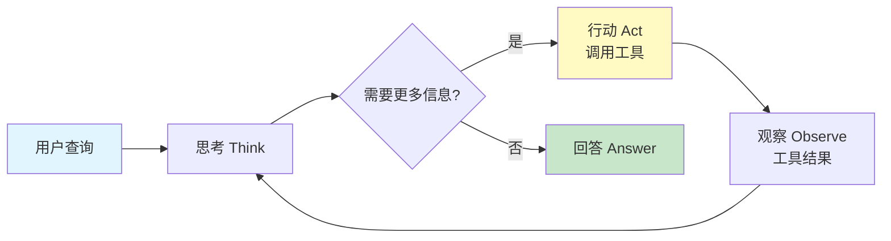
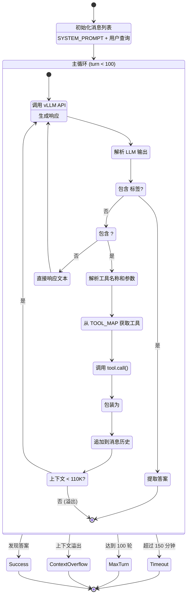

# Tongyi DeepResearch 项目完整指南

> **一份帮助您快速理解和使用 Tongyi DeepResearch 的完整指南**

---

## 📚 目录

- [1. 项目概述](#1-项目概述)
- [2. 核心概念](#2-核心概念)
- [3. 快速开始](#3-快速开始)
- [4. 系统架构深度解析](#4-系统架构深度解析)
- [5. 使用指南](#5-使用指南)
- [6. 高级功能](#6-高级功能)
- [7. 开发指南](#7-开发指南)
- [8. 常见问题](#8-常见问题)

---

## 1. 项目概述

### 1.1 Tongyi DeepResearch 是什么？

**Tongyi DeepResearch（通义深度研究）** 是阿里巴巴通义实验室开发的一个**深度信息搜索代理系统**，专门用于解决需要长时间、多步骤推理的复杂研究任务。

#### 核心特点

```
┌─────────────────────────────────────────────────────────────┐
│                  Tongyi DeepResearch 核心能力                │
├─────────────────────────────────────────────────────────────┤
│                                                               │
│  🧠 30.5B 参数 MoE 模型                                       │
│     • 每个 token 只激活 3.3B 参数                            │
│     • 128K 上下文窗口                                         │
│     • 针对代理任务优化的训练流程                              │
│                                                               │
│  🔍 多源信息整合                                              │
│     • 网络搜索 (Google Search)                                │
│     • 学术搜索 (Google Scholar)                               │
│     • 网页深度阅读 + AI 摘要                                  │
│     • 文档解析 (PDF, Word, Excel, 视频等 15+ 格式)           │
│     • Python 代码执行                                         │
│                                                               │
│  🎯 长视野推理                                                │
│     • 最多 100 轮交互                                         │
│     • 150 分钟推理时间                                        │
│     • 自主工具调用决策                                        │
│                                                               │
│  📊 SOTA 性能                                                 │
│     • Humanity's Last Exam: 领先性能                          │
│     • BrowseComp: 12.0% (en), 30.1% (zh)                     │
│     • GAIA: 60.19%                                            │
│     • WebWalkerQA: 52.50%                                     │
│                                                               │
└─────────────────────────────────────────────────────────────┘
```

### 1.2 它能做什么？

#### 典型应用场景

| 场景 | 示例任务 | 需要的能力 |
|------|---------|-----------|
| 🔬 **学术研究** | "总结 2024 年量子计算领域的三大突破" | 学术搜索 + 论文阅读 + 信息综合 |
| 💼 **市场分析** | "分析 Tesla 在中国新能源车市场的竞争态势" | 网络搜索 + 数据提取 + 对比分析 |
| 📊 **数据处理** | "分析这个 Excel 表格并生成可视化" | 文件解析 + Python 执行 + 数据分析 |
| 🌐 **信息验证** | "验证某个新闻事件的真实性" | 多源搜索 + 交叉验证 + 时间线重建 |
| 📖 **深度阅读** | "阅读这份 200 页的技术报告，提取关键信息" | PDF 解析 + 内容理解 + 摘要生成 |
| 🧮 **复杂计算** | "计算某个数学/统计问题" | Python 执行 + 数值计算 + 结果验证 |

#### 真实案例演示

**案例 1: 多跳推理查询**
```
用户: "找出 2024 年诺贝尔物理学奖得主的母校，并列出该校近 10 年的诺奖得主数量"

DeepResearch 执行过程:
1. 🔍 搜索 "2024 诺贝尔物理学奖得主"
2. 📄 访问诺贝尔官网获取详细信息
3. 🔍 搜索得主的教育背景
4. 📄 访问大学官网
5. 🔍 搜索该校历年诺奖得主
6. 📊 整合信息，生成答案
```

**案例 2: 文档分析 + 编程**
```
用户: "分析这个销售数据 Excel，计算同比增长率并画图"

DeepResearch 执行过程:
1. 📁 解析 Excel 文件，提取数据
2. 🐍 编写 Python 代码计算增长率
3. 🐍 使用 matplotlib 生成可视化
4. 📊 返回分析结果和图表
```

### 1.3 与其他 AI 系统的区别

| 特性 | 传统 LLM (GPT-4, Claude) | Tongyi DeepResearch |
|------|-------------------------|---------------------|
| **知识更新** | 训练截止日期前的知识 | 实时网络搜索 |
| **信息来源** | 内部参数记忆 | 外部多源验证 |
| **推理深度** | 单次对话 | 100+ 轮迭代推理 |
| **工具使用** | 有限的函数调用 | 自主的多工具编排 |
| **证据追溯** | 无法提供来源 | 完整的信息来源链 |
| **复杂任务** | 需要人工拆解 | 自动任务分解 |

### 1.4 项目组成

```
DeepResearch 生态系统
├─ 📦 核心推理引擎
│  ├─ ReAct Agent (推理 + 行动循环)
│  ├─ 5 个核心工具 (搜索、访问、文件、代码、学术)
│  └─ vLLM 推理服务器
│
├─ 🌐 WebAgent 家族 (13+ 专业代理)
│  ├─ WebDancer (原生搜索代理)
│  ├─ WebSailor (超人推理)
│  ├─ WebWatcher (视觉语言代理)
│  ├─ NestBrowse (浏览器代理)
│  └─ ... (更多专业代理)
│
├─ 🧪 评估框架
│  ├─ 多基准测试支持
│  └─ LLM 评判器
│
└─ 🛠️ 训练基础设施
   ├─ 数据合成管道
   └─ 强化学习框架
```

---

## 2. 核心概念

### 2.1 ReAct 范式

**ReAct = Reasoning (推理) + Acting (行动)**

这是一种让 AI 模型交替进行思考和行动的推理模式。

```
传统 LLM:
用户提问 → 模型回答 ✓

ReAct Agent:
用户提问
  → 模型思考：我需要搜索最新信息
  → 行动：调用搜索工具
  → 观察：得到搜索结果
  → 模型思考：我需要访问某个网页
  → 行动：调用访问工具
  → 观察：得到网页内容
  → 模型思考：现在我有足够信息了
  → 回答：给出最终答案 ✓
```

#### ReAct 循环可视化



### 2.2 工具系统 (Tool System)

每个工具都是代理与外部世界交互的接口。

#### 工具架构

```
┌─────────────────────────────────────────────────────────┐
│                      工具注册表                          │
│             TOOL_MAP = {工具名: 工具实例}                │
└────────────────────┬────────────────────────────────────┘
                     │
        ┌────────────┴────────────┐
        │                         │
        ▼                         ▼
┌─────────────────┐      ┌─────────────────┐
│  外部 API 工具   │      │  计算型工具      │
├─────────────────┤      ├─────────────────┤
│ • Search        │      │ • Python        │
│ • Visit         │      │   Interpreter   │
│ • Scholar       │      └─────────────────┘
│ • FileParser    │
└─────────────────┘

调用流程:
<tool_call>                    工具执行
{"name": "search",    →    Serper API
 "arguments": {...}}        返回结果
</tool_call>                   ↓
                     <tool_response>
                     搜索结果...
                     </tool_response>
```

#### 5 大核心工具详解

**1. 🔍 Search (网络搜索)**
```python
功能: Google 搜索
API: Serper.dev
输入: {"query": ["查询1", "查询2"]}
输出: Top 10 搜索结果 (标题、URL、摘要、日期)
特性:
  • 批量查询支持
  • 中英文自动检测
  • 5 次重试机制
```

**2. 📄 Visit (网页访问)**
```python
功能: 深度网页阅读 + AI 摘要
API: Jina AI (抓取) + OpenAI (摘要)
输入: {"url": ["网址"], "goal": "信息目标"}
输出: {rational, evidence, summary}
特性:
  • 三阶段处理: 抓取 → 截断 → 摘要
  • 最大处理 95K tokens
  • 结构化信息提取
```

**3. 📁 FileParser (文件解析)**
```python
功能: 多格式文件解析
支持: PDF, Word, Excel, PPT, 视频, 音频等 15+ 格式
API: Alibaba Dashscope IDP
输入: {"files": ["文件名1", "文件名2"]}
输出: Markdown 格式的文件内容
特性:
  • 异步批量处理
  • 表格、图像提取
  • OCR 支持
```

**4. 🐍 PythonInterpreter (代码执行)**
```python
功能: 安全的 Python 代码执行
API: SandboxFusion (字节跳动)
输入: Python 代码 (在 <code> 标签中)
输出: stdout + stderr + 执行时间
特性:
  • 沙箱隔离
  • 8 次重试
  • 50 秒超时
  • 多端点负载均衡
```

**5. 🎓 Scholar (学术搜索)**
```python
功能: Google Scholar 学术搜索
API: Serper Scholar
输入: {"query": ["学术查询"]}
输出: Top 10 论文 (标题、作者、引用数、PDF 链接)
特性:
  • 并发查询 (3 线程)
  • 引用信息提取
  • PDF 直链
```

### 2.3 提示词工程 (Prompt Engineering)

系统提示词定义了代理的行为和能力边界。

**核心提示词结构**:

```xml
SYSTEM_PROMPT = """
[身份定义]
You are a deep research assistant...

[工具定义]
<tools>
{"type": "function", "function": {"name": "search", ...}}
{"type": "function", "function": {"name": "visit", ...}}
...
</tools>

[调用格式]
<tool_call>
{"name": <function-name>, "arguments": <args-json-object>}
</tool_call>

[终止标记]
<answer>最终答案</answer>

[当前日期]
Current date: 2026-01-19
"""
```

**关键设计原则**:
1. ✅ **明确的角色定义**: "你是一个深度研究助手"
2. ✅ **结构化的工具描述**: JSON Schema 格式
3. ✅ **清晰的输出格式**: XML 标签包裹
4. ✅ **上下文信息**: 当前日期、可用资源

### 2.4 训练范式

Tongyi DeepResearch 使用四阶段训练：

```
阶段 1: 🗂️ 数据构建
├─ 合成高质量搜索任务
├─ 收集专家轨迹
└─ 数据清洗和格式化

阶段 2: 🎲 轨迹采样
├─ 使用基础模型生成多样化轨迹
├─ 正负样本标注
└─ 轨迹质量评估

阶段 3: 📚 监督微调 (SFT)
├─ 在专家轨迹上训练
├─ 学习工具使用模式
└─ 冷启动性能提升

阶段 4: 🎮 强化学习 (RL)
├─ 奖励模型训练
├─ GRPO/DUPO 策略优化
└─ 泛化能力提升
```

---

## 3. 快速开始

### 3.1 环境准备

#### 系统要求

```
硬件:
  • GPU: NVIDIA A100 (40GB+) 或 H100 推荐
  • 显存: 至少 30GB (单卡)
  • CPU: 16+ 核推荐
  • 内存: 64GB+ 推荐

软件:
  • Python: 3.10.0 (必须，其他版本可能有依赖问题)
  • CUDA: 12.0+
  • 操作系统: Linux (推荐), macOS (有限支持)
```

#### 步骤 1: 克隆仓库

```bash
git clone https://github.com/Alibaba-NLP/DeepResearch.git
cd DeepResearch
```

#### 步骤 2: 创建 Python 环境

```bash
# 使用 Conda (推荐)
conda create -n react_infer_env python=3.10.0
conda activate react_infer_env

# 或使用 virtualenv
python3.10 -m venv venv
source venv/bin/activate
```

#### 步骤 3: 安装依赖

```bash
pip install -r requirements.txt
```

**依赖说明**:
- `vllm`: 高性能 LLM 推理引擎
- `transformers`: Hugging Face 模型库
- `qwen-agent`: 通义代理框架
- `openai`: OpenAI API 客户端
- `requests`: HTTP 请求库
- `asyncio`: 异步 IO 支持

### 3.2 配置 API 密钥

#### 步骤 1: 复制配置文件

```bash
cp .env.example .env
```

#### 步骤 2: 编辑 `.env` 文件

```bash
# 必需的 API 密钥
SERPER_KEY_ID=your_serper_key              # https://serper.dev/
JINA_API_KEYS=your_jina_key                # https://jina.ai/
API_KEY=your_openai_key                    # https://platform.openai.com/
API_BASE=https://api.openai.com/v1
DASHSCOPE_API_KEY=your_dashscope_key       # https://dashscope.aliyun.com/

# 可选: Python 代码执行沙箱
SANDBOX_FUSION_ENDPOINT=http://localhost:8080

# 模型和数据路径
MODEL_PATH=/path/to/Tongyi-DeepResearch-30B-A3B
DATASET=eval_data/my_questions.jsonl
OUTPUT_PATH=./outputs
```

#### 获取 API 密钥指南

**Serper (搜索 + 学术)**
1. 访问 https://serper.dev/
2. 注册账号
3. 获取 API Key (免费额度: 2,500 次/月)

**Jina (网页阅读)**
1. 访问 https://jina.ai/
2. 注册并进入 API Dashboard
3. 创建 API Key (免费额度: 1,000 次/天)

**OpenAI (摘要生成)**
1. 访问 https://platform.openai.com/
2. 获取 API Key
3. 或使用兼容的 API (Azure OpenAI, 通义千问等)

**Dashscope (文件解析)**
1. 访问 https://dashscope.aliyun.com/
2. 阿里云账号登录
3. 开通服务并获取 API Key

**SandboxFusion (可选, Python 执行)**
1. 参考 https://github.com/bytedance/SandboxFusion
2. 本地部署沙箱服务
3. 配置端点 URL

### 3.3 下载模型

#### 选项 1: 从 Hugging Face 下载

```bash
# 使用 git-lfs
git lfs install
git clone https://huggingface.co/Alibaba-NLP/Tongyi-DeepResearch-30B-A3B

# 或使用 huggingface-cli
pip install huggingface-hub
huggingface-cli download Alibaba-NLP/Tongyi-DeepResearch-30B-A3B \
    --local-dir ./models/deepresearch
```

#### 选项 2: 从 ModelScope 下载

```bash
pip install modelscope
modelscope download --model iic/Tongyi-DeepResearch-30B-A3B \
    --local_dir ./models/deepresearch
```

#### 选项 3: 使用 OpenRouter API (无需下载)

编辑 `inference/react_agent.py`:

```python
# 第 61-62 行
openai_api_key = "YOUR_OPENROUTER_KEY"
openai_api_base = "https://openrouter.ai/api/v1"

# 第 76 行
model = "alibaba/tongyi-deepresearch-30b-a3b"

# 取消注释第 87-88 行
reasoning_content = "<think>\n" + chat_response.choices[0].message.reasoning.strip() + "\n</think>"
content = reasoning_content + content
```

### 3.4 准备数据集

#### 数据格式

支持两种格式: **JSONL** (推荐) 和 **JSON**

**JSONL 格式**:
```jsonl
{"question": "2024 年诺贝尔物理学奖得主是谁？", "answer": "约翰·霍普菲尔德和杰弗里·辛顿"}
{"question": "量子计算的最新进展有哪些？", "answer": "参考答案..."}
{"question": "分析这个 Excel 表格的销售趋势", "answer": ""}
```

**JSON 格式**:
```json
[
  {
    "question": "2024 年诺贝尔物理学奖得主是谁？",
    "answer": "约翰·霍普菲尔德和杰弗里·辛顿"
  },
  {
    "question": "量子计算的最新进展有哪些？",
    "answer": "参考答案..."
  }
]
```

**字段说明**:
- `question`: 用户查询（必需）
- `answer`: 参考答案，用于评估（可选，留空表示仅生成答案）

#### 文件引用

如果问题涉及文件，需要：

1. **在问题中声明文件**:
```json
{
  "question": "(Uploaded 1 file: ['report.pdf'])\n\n总结这份报告的关键发现",
  "answer": "..."
}
```

2. **将文件放入 `eval_data/file_corpus/` 目录**:
```bash
mkdir -p eval_data/file_corpus
cp /path/to/report.pdf eval_data/file_corpus/
```

#### 示例数据集

创建测试文件 `eval_data/test_questions.jsonl`:

```jsonl
{"question": "什么是 Transformer 架构？请简要解释其工作原理。", "answer": ""}
{"question": "搜索并总结 GPT-4 和 Claude 3 的主要区别", "answer": ""}
{"question": "用 Python 计算斐波那契数列的第 20 项", "answer": "6765"}
```

### 3.5 运行第一次推理

#### 方法 1: 使用启动脚本 (推荐)

```bash
# 编辑配置
vim .env

# 确保设置:
# MODEL_PATH=/path/to/model
# DATASET=eval_data/test_questions.jsonl
# OUTPUT_PATH=./outputs

# 运行
bash inference/run_react_infer.sh
```

**脚本会自动**:
1. 启动 8 个 vLLM 服务器 (端口 6001-6008)
2. 等待服务器就绪
3. 运行推理任务
4. 保存结果到 `OUTPUT_PATH`

#### 方法 2: 手动启动

**步骤 1: 启动 vLLM 服务器**

```bash
# 终端 1
CUDA_VISIBLE_DEVICES=0 vllm serve /path/to/model \
    --host 0.0.0.0 --port 6001 --disable-log-requests

# 终端 2 (如果有多个 GPU)
CUDA_VISIBLE_DEVICES=1 vllm serve /path/to/model \
    --host 0.0.0.0 --port 6002 --disable-log-requests
```

**步骤 2: 运行推理**

```bash
cd inference

python run_multi_react.py \
    --model /path/to/model \
    --dataset ../eval_data/test_questions.jsonl \
    --output ../outputs \
    --max_workers 2 \
    --roll_out_count 1 \
    --temperature 0.85 \
    --presence_penalty 1.1
```

#### 方法 3: 使用 OpenRouter (最简单)

如果配置了 OpenRouter，可以直接运行推理而无需本地部署模型：

```bash
cd inference

python run_multi_react.py \
    --model "alibaba/tongyi-deepresearch-30b-a3b" \
    --dataset ../eval_data/test_questions.jsonl \
    --output ../outputs \
    --max_workers 5
```

### 3.6 查看结果

#### 输出目录结构

```bash
outputs/
├── test_questions_rollout_0.jsonl    # 第 1 次 rollout
├── test_questions_rollout_1.jsonl    # 第 2 次 rollout
├── test_questions_rollout_2.jsonl    # 第 3 次 rollout
└── test_questions_summary.json       # 汇总统计
```

#### 单条结果格式

```json
{
  "question": "什么是 Transformer 架构？",
  "answer": "",
  "prediction": "Transformer 是一种基于自注意力机制的...",
  "termination": "answer",
  "messages": [
    {"role": "system", "content": "You are a deep research assistant..."},
    {"role": "user", "content": "什么是 Transformer 架构？"},
    {"role": "assistant", "content": "<think>用户询问 Transformer...</think>\n<tool_call>\n{\"name\": \"search\", \"arguments\": {\"query\": [\"Transformer 架构\"]}}\n</tool_call>"},
    {"role": "user", "content": "<tool_response>\n搜索结果...\n</tool_response>"},
    {"role": "assistant", "content": "<answer>Transformer 是...</answer>"}
  ],
  "summary_record": "简化的交互记录"
}
```

**字段说明**:
- `prediction`: 模型生成的答案
- `termination`: 终止原因
  - `answer`: 正常完成
  - `timeout`: 超时
  - `max_turn_exceeded`: 达到最大轮次
  - `context_length_exceeded`: 上下文溢出
- `messages`: 完整的对话历史

#### 查看实时日志

```bash
# 监控推理进度
tail -f outputs/test_questions_rollout_0.jsonl

# 查看 vLLM 服务器日志
# (在启动 vLLM 的终端查看)
```

---

## 4. 系统架构深度解析

### 4.1 整体架构图

```
┌──────────────────────────────────────────────────────────────────────┐
│                         用户层 (User Layer)                           │
│  • 研究人员输入复杂查询                                                │
│  • 评估基准数据集 (GAIA, HLE, BrowseComp 等)                          │
└────────────────────────────┬─────────────────────────────────────────┘
                             │
                             ▼
┌──────────────────────────────────────────────────────────────────────┐
│                    数据处理层 (Data Processing Layer)                 │
│                                                                        │
│  ┌──────────────────────────────────────────────────────────┐        │
│  │  run_multi_react.py (编排器)                              │        │
│  │                                                            │        │
│  │  • 加载数据集 (JSONL/JSON)                                │        │
│  │  • ThreadPoolExecutor (默认 20 线程)                      │        │
│  │  • 端口轮询 (6001-6008)                                   │        │
│  │  • Rollout 管理 (每个问题 3 次)                           │        │
│  │  • 检查点机制 (断点续传)                                  │        │
│  └──────────────┬───────────────────────────────────────────┘        │
└─────────────────┼────────────────────────────────────────────────────┘
                  │
                  ▼
┌──────────────────────────────────────────────────────────────────────┐
│                    代理层 (Agent Layer)                               │
│                                                                        │
│  ┌──────────────────────────────────────────────────────────┐        │
│  │  MultiTurnReactAgent (ReAct 核心)                         │        │
│  │                                                            │        │
│  │  📝 初始化                                                 │        │
│  │     messages = [system_prompt, user_query]                │        │
│  │                                                            │        │
│  │  🔄 主循环 (最多 100 轮)                                  │        │
│  │     for turn in range(100):                               │        │
│  │         ┌─────────────────────────────────────┐           │        │
│  │         │ 1. LLM 推理                          │           │        │
│  │         │    response = call_server()          │           │        │
│  │         └─────────────────────────────────────┘           │        │
│  │         ┌─────────────────────────────────────┐           │        │
│  │         │ 2. 解析响应                          │           │        │
│  │         │    if <answer>: 完成                │           │        │
│  │         │    if <tool_call>: 执行工具         │           │        │
│  │         └─────────────────────────────────────┘           │        │
│  │         ┌─────────────────────────────────────┐           │        │
│  │         │ 3. 工具调用                          │           │        │
│  │         │    result = TOOL_MAP[tool_name]()   │           │        │
│  │         └─────────────────────────────────────┘           │        │
│  │         ┌─────────────────────────────────────┐           │        │
│  │         │ 4. 更新上下文                        │           │        │
│  │         │    messages.append(tool_response)   │           │        │
│  │         └─────────────────────────────────────┘           │        │
│  │                                                            │        │
│  │  ⚠️ 终止条件检查                                          │        │
│  │     • 上下文长度 > 110K tokens                             │        │
│  │     • 时间超过 150 分钟                                    │        │
│  │     • 达到 100 轮                                          │        │
│  └──────────────┬───────────────────────────────────────────┘        │
└─────────────────┼────────────────────────────────────────────────────┘
                  │
                  ▼
┌──────────────────────────────────────────────────────────────────────┐
│                    工具层 (Tool Layer)                                │
│                                                                        │
│  ┌────────────┐  ┌────────────┐  ┌────────────┐  ┌────────────┐    │
│  │  Search    │  │   Visit    │  │ FileParser │  │  Scholar   │    │
│  │            │  │            │  │            │  │            │    │
│  │ Serper API │  │ Jina + LLM │  │ Dashscope  │  │ Serper API │    │
│  │            │  │            │  │ IDP        │  │            │    │
│  │ • 批量查询 │  │ • 3 阶段   │  │ • 15+ 格式 │  │ • 引用计数 │    │
│  │ • 重试     │  │ • 95K 截断 │  │ • 异步解析 │  │ • PDF 链接 │    │
│  └────────────┘  └────────────┘  └────────────┘  └────────────┘    │
│                                                                        │
│  ┌────────────────────────────────────────┐                          │
│  │       PythonInterpreter                 │                          │
│  │                                          │                          │
│  │ SandboxFusion (字节跳动沙箱)             │                          │
│  │ • 隔离执行环境                           │                          │
│  │ • 8 次重试                               │                          │
│  │ • 50 秒超时                              │                          │
│  │ • 多端点负载均衡                         │                          │
│  └────────────────────────────────────────┘                          │
└─────────────────┬────────────────────────────────────────────────────┘
                  │
                  ▼
┌──────────────────────────────────────────────────────────────────────┐
│                    模型推理层 (Inference Layer)                       │
│                                                                        │
│  ┌──────────────────────────────────────────────────────────┐        │
│  │         vLLM 服务器集群 (Multi-GPU)                       │        │
│  │                                                            │        │
│  │  端口 6001 ◄─┐                        ┌─► 端口 6005      │        │
│  │  端口 6002 ◄─┤                        ├─► 端口 6006      │        │
│  │  端口 6003 ◄─┼─  轮询调度  ───────────┼─► 端口 6007      │        │
│  │  端口 6004 ◄─┘                        └─► 端口 6008      │        │
│  │                                                            │        │
│  │  模型: Tongyi-DeepResearch-30B-A3B                        │        │
│  │  • 30.5B 总参数                                           │        │
│  │  • 3.3B 激活参数/token                                    │        │
│  │  • 128K 上下文窗口                                        │        │
│  │  • temperature=0.85, presence_penalty=1.1                 │        │
│  └──────────────────────────────────────────────────────────┘        │
└─────────────────┬────────────────────────────────────────────────────┘
                  │
                  ▼
┌──────────────────────────────────────────────────────────────────────┐
│                    输出层 (Output Layer)                              │
│                                                                        │
│  • JSONL 格式结果文件                                                 │
│  • 完整对话历史 (messages)                                            │
│  • 终止原因标记 (termination)                                         │
│  • 可供评估的预测答案 (prediction)                                    │
└──────────────────────────────────────────────────────────────────────┘
```

### 4.2 ReAct 执行流程详解

#### 流程图



#### 代码路径追踪

**入口**: `inference/run_multi_react.py:main()`

```python
# 第 55 行: 加载数据集
dataset = load_jsonl_or_json(args.dataset)

# 第 62 行: 创建线程池
with ThreadPoolExecutor(max_workers=args.max_workers) as executor:
    # 第 70 行: 提交任务
    futures = []
    for idx, sample in enumerate(dataset):
        for rollout in range(args.roll_out_count):
            port = ports[idx % len(ports)]
            future = executor.submit(
                process_sample,  # ← 关键函数
                sample,
                args.model,
                port,
                rollout
            )
            futures.append(future)
```

**核心函数**: `process_sample()` → `MultiTurnReactAgent._run()`

```python
# inference/react_agent.py:126-226

def _run(self, data, model, planning_port):
    # 第 134 行: 初始化消息
    messages = [
        {"role": "system", "content": SYSTEM_PROMPT + today_date()},
        {"role": "user", "content": data['question']}
    ]

    # 第 141 行: 主循环
    for turn in range(MAX_LLM_CALL_PER_RUN):  # 100 轮
        # 第 145 行: 调用 LLM
        response = self.call_server(messages, planning_port)
        messages.append({"role": "assistant", "content": response})

        # 第 155 行: 检查答案
        if "<answer>" in response and "</answer>" in response:
            prediction = extract_between_tags(response, "answer")
            return messages, prediction, "answer"

        # 第 165 行: 检查工具调用
        if "<tool_call>" in response:
            tool_calls = extract_tool_calls(response)

            for tool_call in tool_calls:
                # 第 170 行: 解析工具
                func_name = tool_call["name"]
                func_args = tool_call["arguments"]

                # 第 180 行: 执行工具
                tool_result = self.custom_call_tool(func_name, func_args)

                # 第 185 行: 包装响应
                obs = f"<tool_response>\n{tool_result}\n</tool_response>"
                messages.append({"role": "user", "content": obs})

        # 第 195 行: 检查上下文长度
        if get_token_count(messages) > 110000:
            return messages, None, "context_length_exceeded"

        # 第 205 行: 检查超时
        if time.time() - start_time > 9000:  # 150 分钟
            return messages, None, "timeout"

    # 第 220 行: 达到最大轮次
    return messages, None, "max_turn_exceeded"
```

### 4.3 工具执行深度分析

#### 以 Visit 工具为例

**完整调用链**:

```
用户查询
  └─> ReAct Agent 决策需要访问网页
      └─> 生成 <tool_call>{"name": "visit", "arguments": {...}}</tool_call>
          └─> custom_call_tool() 解析并路由
              └─> TOOL_MAP["visit"].call(params)
                  │
                  └─> tool_visit.py:Visit.call()
                      │
                      ├─ 步骤 1: 解析参数
                      │  url_list = params["url"]
                      │  goal = params["goal"]
                      │
                      ├─ 步骤 2: 抓取网页 (readpage_jina)
                      │  └─> requests.get(f"https://r.jina.ai/{url}")
                      │      • 认证: Bearer {JINA_API_KEY}
                      │      • 超时: 200 秒
                      │      • 重试: 3 次
                      │      • 返回: Markdown 格式的网页内容
                      │
                      ├─ 步骤 3: Token 截断
                      │  if len(tokens) > 95000:
                      │      content = truncate(content, 95000)
                      │
                      ├─ 步骤 4: LLM 摘要 (extract_relevant_info)
                      │  └─> OpenAI API 调用
                      │      • Prompt: EXTRACTOR_PROMPT
                      │      • 输入: {webpage_content, goal}
                      │      • 输出: JSON {rational, evidence, summary}
                      │      • 重试: 3 次
                      │
                      └─ 步骤 5: 格式化返回
                         return f"""
                         # URL: {url}

                         **理由**: {rational}
                         **证据**: {evidence}
                         **总结**: {summary}
                         """
```

**性能特性**:

| 阶段 | 耗时 (估算) | 瓶颈 | 优化方向 |
|-----|------------|------|---------|
| Jina 抓取 | 2-10 秒 | 网络 I/O | 并发抓取、缓存 |
| Token 截断 | <1 秒 | 计算 | 已优化 |
| LLM 摘要 | 5-20 秒 | API 调用 | 批量处理、更快模型 |
| 总计 | 7-31 秒/页 | - | 异步化、缓存 |

#### 工具并发模式对比

**当前模式: 串行执行**
```python
for tool_call in tool_calls:
    result = execute_tool(tool_call)
    # 等待完成后再执行下一个
```

**优化后: 并行执行** (扩展点)
```python
# 分组相同类型的工具
grouped = group_by_tool_type(tool_calls)

# 批量执行
results = {}
for tool_type, calls in grouped.items():
    if tool_type in ["search", "visit", "scholar"]:
        # 可以并行
        results[tool_type] = asyncio.gather(*[
            execute_async(call) for call in calls
        ])
    else:
        # 串行
        results[tool_type] = [execute(call) for call in calls]
```

### 4.4 WebAgent 家族架构

DeepResearch 包含一个庞大的 WebAgent 家族，每个成员都有专门的能力。

#### 家族关系图

```
┌────────────────────────────────────────────────────────────────┐
│                    Tongyi DeepResearch (核心)                   │
│         主推理引擎 + 5 大工具 + ReAct 范式                       │
└──────────────────────┬─────────────────────────────────────────┘
                       │
        ┌──────────────┴──────────────┐
        │                             │
        ▼                             ▼
┌───────────────────┐         ┌───────────────────┐
│  基础代理家族      │         │  专业代理家族      │
├───────────────────┤         ├───────────────────┤
│ • WebWalker       │         │ • WebWatcher      │
│   基准测试        │         │   视觉语言        │
│                   │         │                   │
│ • WebDancer       │         │ • WebShaper       │
│   原生搜索        │         │   数据合成        │
│                   │         │                   │
│ • WebSailor       │         │ • WebWeaver       │
│   超人推理        │         │   证据结构化      │
└───────────────────┘         └───────────────────┘
        │                             │
        ▼                             ▼
┌───────────────────┐         ┌───────────────────┐
│  系统增强家族      │         │  推理增强家族      │
├───────────────────┤         ├───────────────────┤
│ • NestBrowse      │         │ • ParallelMuse    │
│   浏览器交互      │         │   并行轨迹        │
│                   │         │                   │
│ • WebResummer     │         │ • WebResearcher   │
│   上下文摘要      │         │   长视野推理      │
│                   │         │                   │
│ • WebLeaper       │         │ • AgentScaler     │
│   信息跳跃        │         │   持续预训练      │
└───────────────────┘         └───────────────────┘
```

#### 代表性项目深度解析

**1. NestBrowse - 浏览器代理**

```
特点: 使用 MCP (Model Context Protocol) 与浏览器交互

架构:
WebAgent/NestBrowse/
├─ infer_async_nestbrowse.py    # 异步主循环
├─ toolkit/
│  ├─ browser.py                # 浏览器工具
│  │  ├─ Visit(url)             # 导航到 URL
│  │  ├─ Click(element_id)      # 点击元素
│  │  └─ Fill(element_id, text) # 填充表单
│  ├─ mcp_client.py             # MCP 协议客户端
│  └─ tool_search.py            # 搜索工具
└─ prompts.py                   # 提示词

执行模式:
async def agentic_loop():
    for turn in range(MAX_AGENT_TURN):
        # 异步调用 LLM
        async with sem['llm']:
            response = await call_llm()

        # 解析工具调用
        if "<tool_call>" in response:
            # 异步执行工具
            async with sem['tool']:
                result = await call_tool()

        # 检查终止条件
        if "<answer>" in response:
            break

性能优势:
• 异步 I/O: 多个网页可并发处理
• 信号量限流: 控制并发数，避免过载
• 浏览器状态: 支持多步交互 (点击、填表、翻页)
```

**2. ParallelMuse - 并行轨迹聚合**

```
特点: 运行多个独立轨迹，然后聚合结果

架构:
WebAgent/ParallelMuse/
├─ compressed_reasoning_aggregation.py
│  ├─ call_state_report()      # 轨迹 → 报告
│  └─ call_info_integrate()    # 报告 → 最终答案
└─ prompts.py
   ├─ REPORT_PROMPT             # 提取推理过程
   └─ INTEGRATE_PROMPT          # 聚合多个报告

工作流程:
1. 生成 N 个独立轨迹 (rollouts)
   rollouts = [run_agent(question) for _ in range(N)]

2. 为每个轨迹生成结构化报告
   reports = []
   for rollout in rollouts:
       report = LLM(REPORT_PROMPT + rollout.messages)
       # 输出: {solution_planning, methods, final_reasoning}
       reports.append(report)

3. 聚合所有报告
   final_answer = LLM(INTEGRATE_PROMPT + reports)
   # 分析一致性、选择最佳答案

优势:
• 多样性: 不同轨迹探索不同路径
• 鲁棒性: 单个轨迹失败不影响整体
• 质量: 聚合可以过滤错误答案
```

**3. WebSailor - 超人推理**

```
特点: 2 阶段训练 + DUPO 强化学习

训练流程:
阶段 1: RFT (Rejection Fine-Tuning) 冷启动
• 收集专家轨迹 + 模型轨迹
• 人工标注正负样本
• 仅在正样本上微调

阶段 2: DUPO (Duplicating Sampling Policy Optimization)
• 每个查询采样多个轨迹
• 计算奖励: R = f(answer, ground_truth)
• 策略梯度更新: ∇θ = E[R * ∇log π(a|s)]

数据集: SailorFog-QA
• 高不确定性、高难度 QA 数据
• 图采样 + 信息混淆生成
• 需要多跳推理和深度搜索

性能:
• BrowseComp-en: 12.0%
• BrowseComp-zh: 30.1%
• GAIA: 55.4%
```

---

## 5. 使用指南

### 5.1 基础使用

#### 场景 1: 简单事实查询

```bash
# 创建查询文件
cat > eval_data/simple_query.jsonl << EOF
{"question": "2024 年图灵奖得主是谁？", "answer": ""}
EOF

# 运行推理
python inference/run_multi_react.py \
    --model $MODEL_PATH \
    --dataset eval_data/simple_query.jsonl \
    --output outputs \
    --max_workers 1 \
    --roll_out_count 1

# 查看结果
cat outputs/simple_query_rollout_0.jsonl | jq '.prediction'
```

**预期执行流程**:
```
1. [Search] "2024 图灵奖得主"
2. [Visit] ACM 官网页面
3. [Answer] 答案: XXX
```

#### 场景 2: 学术文献调研

```bash
# 查询
cat > eval_data/academic_query.jsonl << EOF
{"question": "总结 2024 年 NeurIPS 关于 Transformer 优化的主要论文", "answer": ""}
EOF

# 运行
python inference/run_multi_react.py \
    --model $MODEL_PATH \
    --dataset eval_data/academic_query.jsonl \
    --output outputs \
    --max_workers 1
```

**预期执行流程**:
```
1. [Scholar] "NeurIPS 2024 Transformer optimization"
2. [Visit] 论文 1 页面，提取摘要
3. [Visit] 论文 2 页面，提取摘要
4. [Visit] 论文 3 页面，提取摘要
5. [Search] "NeurIPS 2024 best papers"
6. [Answer] 综合总结
```

#### 场景 3: 文档分析

```bash
# 准备文件
cp /path/to/report.pdf eval_data/file_corpus/

# 查询
cat > eval_data/doc_query.jsonl << EOF
{"question": "(Uploaded 1 file: ['report.pdf'])\n\n总结这份报告的核心观点和数据支撑", "answer": ""}
EOF

# 运行
python inference/run_multi_react.py \
    --model $MODEL_PATH \
    --dataset eval_data/doc_query.jsonl \
    --output outputs
```

**预期执行流程**:
```
1. [FileParser] 解析 report.pdf
2. [PythonInterpreter] (可选) 如果需要数据分析
3. [Answer] 总结核心观点
```

#### 场景 4: 数据分析 + 可视化

```bash
# 查询
cat > eval_data/data_query.jsonl << EOF
{"question": "生成 1-100 的随机数列表，计算均值和标准差，并画直方图", "answer": ""}
EOF

# 运行
python inference/run_multi_react.py \
    --model $MODEL_PATH \
    --dataset eval_data/data_query.jsonl \
    --output outputs
```

**预期执行流程**:
```
1. [PythonInterpreter]
   import numpy as np
   import matplotlib.pyplot as plt

   data = np.random.randint(1, 101, 100)
   mean = np.mean(data)
   std = np.std(data)

   plt.hist(data, bins=20)
   plt.savefig('histogram.png')

   print(f"均值: {mean}, 标准差: {std}")

2. [Answer] 返回统计结果
```

### 5.2 高级参数调优

#### 温度 (Temperature)

控制生成的随机性。

```bash
# 低温度 (更确定性、更保守)
python run_multi_react.py \
    --temperature 0.3 \
    ...

# 中温度 (平衡，默认)
--temperature 0.85

# 高温度 (更多样性、更创造性)
--temperature 1.2
```

**使用建议**:
- 事实查询: 0.3-0.5
- 开放式研究: 0.7-0.9
- 创意生成: 1.0-1.5

#### Presence Penalty

惩罚已出现的 token，鼓励新内容。

```bash
# 低惩罚 (可能重复)
--presence_penalty 0.5

# 中惩罚 (默认)
--presence_penalty 1.1

# 高惩罚 (强制多样性)
--presence_penalty 1.5
```

#### Rollout 次数

每个问题运行多次，增加鲁棒性。

```bash
# 单次运行 (快速测试)
--roll_out_count 1

# 3 次运行 (默认，平衡)
--roll_out_count 3

# 5 次运行 (高质量，用于评估)
--roll_out_count 5
```

**多 Rollout 的好处**:
- 覆盖不同推理路径
- 可以选择最佳答案 (majority voting)
- 增加成功率

#### 并发工作线程

```bash
# 低并发 (资源受限)
--max_workers 5

# 中并发 (默认)
--max_workers 20

# 高并发 (多 GPU)
--max_workers 50
```

**注意事项**:
- 确保 `max_workers` ≤ vLLM 服务器数量 × 每服务器并发能力
- 过高的并发可能导致 API 限流或 OOM

### 5.3 分布式推理

#### 单机多 GPU

默认配置已支持，无需额外设置。

```bash
# run_react_infer.sh 会自动启动 8 个 vLLM 服务器
bash inference/run_react_infer.sh
```

#### 多节点分布式

**配置环境变量**:

```bash
# 节点 1
export WORLD_SIZE=2
export RANK=0
bash inference/run_react_infer.sh

# 节点 2
export WORLD_SIZE=2
export RANK=1
bash inference/run_react_infer.sh
```

**数据分片逻辑** (`run_multi_react.py`):

```python
# 第 30-45 行
if args.total_splits > 1:
    # 分片索引: [start, end)
    shard_size = len(dataset) // args.total_splits
    start_idx = (args.worker_split - 1) * shard_size
    end_idx = args.worker_split * shard_size if args.worker_split < args.total_splits else len(dataset)
    dataset = dataset[start_idx:end_idx]
```

#### 断点续传

系统自动支持检查点机制。

```bash
# 如果推理中断，重新运行相同命令
python run_multi_react.py \
    --model $MODEL_PATH \
    --dataset eval_data/questions.jsonl \
    --output outputs \
    ...

# 系统会:
# 1. 扫描 outputs/ 目录
# 2. 识别已完成的样本
# 3. 跳过已完成，继续未完成
```

**检查点逻辑** (`run_multi_react.py:25-40`):

```python
def is_completed(output_file, question_id):
    if not os.path.exists(output_file):
        return False

    with open(output_file, 'r') as f:
        for line in f:
            result = json.loads(line)
            if result.get('question_id') == question_id:
                return True
    return False
```

### 5.4 批量处理

#### 处理大规模数据集

```bash
# 假设有 10,000 个查询
wc -l eval_data/large_dataset.jsonl
# 10000 eval_data/large_dataset.jsonl

# 分批处理
python run_multi_react.py \
    --dataset eval_data/large_dataset.jsonl \
    --output outputs \
    --max_workers 20 \
    --roll_out_count 3
    # 预计耗时: 10,000 * 10 min / (20 workers * 3 rollouts) ≈ 28 小时
```

**优化策略**:

1. **增加并发度**
```bash
# 使用更多 GPU
--max_workers 50

# 或使用 OpenRouter (无 GPU 限制)
```

2. **减少 Rollout**
```bash
# 首次运行用 1 次
--roll_out_count 1

# 对重要样本再运行 3 次
```

3. **分布式处理**
```bash
# 节点 1 处理前 5000
python run_multi_react.py \
    --dataset eval_data/large_dataset.jsonl \
    --output outputs_node1 \
    --total_splits 2 \
    --worker_split 1

# 节点 2 处理后 5000
python run_multi_react.py \
    --dataset eval_data/large_dataset.jsonl \
    --output outputs_node2 \
    --total_splits 2 \
    --worker_split 2

# 合并结果
cat outputs_node1/*.jsonl outputs_node2/*.jsonl > outputs/merged.jsonl
```

---

## 6. 高级功能

### 6.1 自定义工具

#### 步骤 1: 创建工具类

创建 `inference/tool_database.py`:

```python
from qwen_agent.tools import BaseTool, register_tool
import json
import sqlite3

@register_tool('database_query')
class DatabaseQuery(BaseTool):
    """查询 SQLite 数据库"""

    description = '执行 SQL 查询并返回结果'
    parameters = [{
        'name': 'query',
        'type': 'string',
        'description': 'SQL 查询语句',
        'required': True
    }, {
        'name': 'database',
        'type': 'string',
        'description': '数据库文件路径',
        'required': True
    }]

    def call(self, params: str, **kwargs) -> str:
        try:
            # 解析参数
            params_dict = json.loads(params)
            query = params_dict['query']
            db_path = params_dict['database']

            # 连接数据库
            conn = sqlite3.connect(db_path)
            cursor = conn.cursor()

            # 执行查询
            cursor.execute(query)
            results = cursor.fetchall()

            # 格式化输出
            output = f"查询: {query}\n\n"
            output += "结果:\n"
            for row in results:
                output += f"  {row}\n"

            conn.close()
            return output

        except Exception as e:
            return f"数据库查询失败: {str(e)}"
```

#### 步骤 2: 注册工具

编辑 `inference/react_agent.py`:

```python
# 第 20 行: 导入新工具
from tool_database import DatabaseQuery

# 第 31-38 行: 添加到工具列表
TOOL_CLASS = [
    FileParser(),
    Scholar(),
    Visit(),
    Search(),
    PythonInterpreter(),
    DatabaseQuery(),  # 新增
]
```

#### 步骤 3: 更新提示词

编辑 `inference/prompt.py`:

```python
SYSTEM_PROMPT = """
...
<tools>
...
{"type": "function", "function": {
    "name": "database_query",
    "description": "执行 SQL 查询并返回结果",
    "parameters": {
        "type": "object",
        "properties": {
            "query": {"type": "string", "description": "SQL 查询语句"},
            "database": {"type": "string", "description": "数据库文件路径"}
        },
        "required": ["query", "database"]
    }
}}
</tools>
"""
```

#### 步骤 4: 测试新工具

```bash
# 创建测试数据库
sqlite3 test.db << EOF
CREATE TABLE users (id INTEGER, name TEXT, age INTEGER);
INSERT INTO users VALUES (1, 'Alice', 30);
INSERT INTO users VALUES (2, 'Bob', 25);
EOF

# 创建查询
cat > eval_data/db_query.jsonl << EOF
{"question": "查询 test.db 数据库中所有用户的姓名和年龄", "answer": ""}
EOF

# 运行推理
python inference/run_multi_react.py \
    --model $MODEL_PATH \
    --dataset eval_data/db_query.jsonl \
    --output outputs
```

### 6.2 自定义评估指标

#### 创建自定义评估脚本

创建 `evaluation/custom_evaluator.py`:

```python
import json
import os
from openai import OpenAI

def evaluate_tool_efficiency(results_file):
    """评估工具使用效率"""

    with open(results_file, 'r') as f:
        results = [json.loads(line) for line in f]

    metrics = {
        'total_samples': len(results),
        'avg_turns': 0,
        'avg_tools_per_sample': 0,
        'tool_distribution': {},
        'success_rate': 0
    }

    total_turns = 0
    total_tools = 0
    successful = 0

    for result in results:
        messages = result['messages']
        turns = len([m for m in messages if m['role'] == 'assistant'])
        total_turns += turns

        # 统计工具调用
        tools_used = []
        for msg in messages:
            if '<tool_call>' in msg.get('content', ''):
                # 提取工具名称
                tool_name = extract_tool_name(msg['content'])
                tools_used.append(tool_name)
                total_tools += 1

        # 更新工具分布
        for tool in tools_used:
            metrics['tool_distribution'][tool] = \
                metrics['tool_distribution'].get(tool, 0) + 1

        # 检查是否成功
        if result['termination'] == 'answer':
            successful += 1

    metrics['avg_turns'] = total_turns / len(results)
    metrics['avg_tools_per_sample'] = total_tools / len(results)
    metrics['success_rate'] = successful / len(results)

    return metrics

def evaluate_answer_quality(results_file, reference_file):
    """使用 LLM 评判答案质量"""

    # 加载结果和参考答案
    with open(results_file, 'r') as f:
        results = [json.loads(line) for line in f]

    with open(reference_file, 'r') as f:
        references = [json.loads(line) for line in f]

    # 创建评判提示词
    JUDGE_PROMPT = """
    请评估以下答案的质量:

    问题: {question}
    参考答案: {reference}
    模型答案: {prediction}

    从以下维度评分 (1-5):
    1. 准确性 (Accuracy): 信息是否正确
    2. 完整性 (Completeness): 是否覆盖关键点
    3. 清晰度 (Clarity): 表达是否清楚
    4. 相关性 (Relevance): 是否切题

    输出 JSON:
    {
        "accuracy": 5,
        "completeness": 4,
        "clarity": 5,
        "relevance": 5,
        "overall": 4.75,
        "reasoning": "评分理由..."
    }
    """

    client = OpenAI(api_key=os.getenv('API_KEY'))

    scores = []
    for result, ref in zip(results, references):
        prompt = JUDGE_PROMPT.format(
            question=result['question'],
            reference=ref['answer'],
            prediction=result['prediction']
        )

        response = client.chat.completions.create(
            model='gpt-4',
            messages=[{'role': 'user', 'content': prompt}]
        )

        score = json.loads(response.choices[0].message.content)
        scores.append(score)

    # 计算平均分
    avg_scores = {
        'accuracy': sum(s['accuracy'] for s in scores) / len(scores),
        'completeness': sum(s['completeness'] for s in scores) / len(scores),
        'clarity': sum(s['clarity'] for s in scores) / len(scores),
        'relevance': sum(s['relevance'] for s in scores) / len(scores),
        'overall': sum(s['overall'] for s in scores) / len(scores)
    }

    return avg_scores, scores

if __name__ == '__main__':
    import argparse

    parser = argparse.ArgumentParser()
    parser.add_argument('--results', required=True)
    parser.add_argument('--references', required=True)
    args = parser.parse_args()

    # 评估效率
    efficiency = evaluate_tool_efficiency(args.results)
    print("工具使用效率:")
    print(json.dumps(efficiency, indent=2, ensure_ascii=False))

    # 评估质量
    avg_scores, detailed_scores = evaluate_answer_quality(
        args.results,
        args.references
    )
    print("\n答案质量:")
    print(json.dumps(avg_scores, indent=2, ensure_ascii=False))
```

#### 运行自定义评估

```bash
python evaluation/custom_evaluator.py \
    --results outputs/test_questions_rollout_0.jsonl \
    --references eval_data/test_questions.jsonl
```

### 6.3 提示词优化

#### Few-Shot 示例

在系统提示词中添加示例：

```python
SYSTEM_PROMPT = """
You are a deep research assistant...

# Examples

## Example 1: Multi-hop Reasoning

User: "谁是 2024 年图灵奖得主的博士导师？"